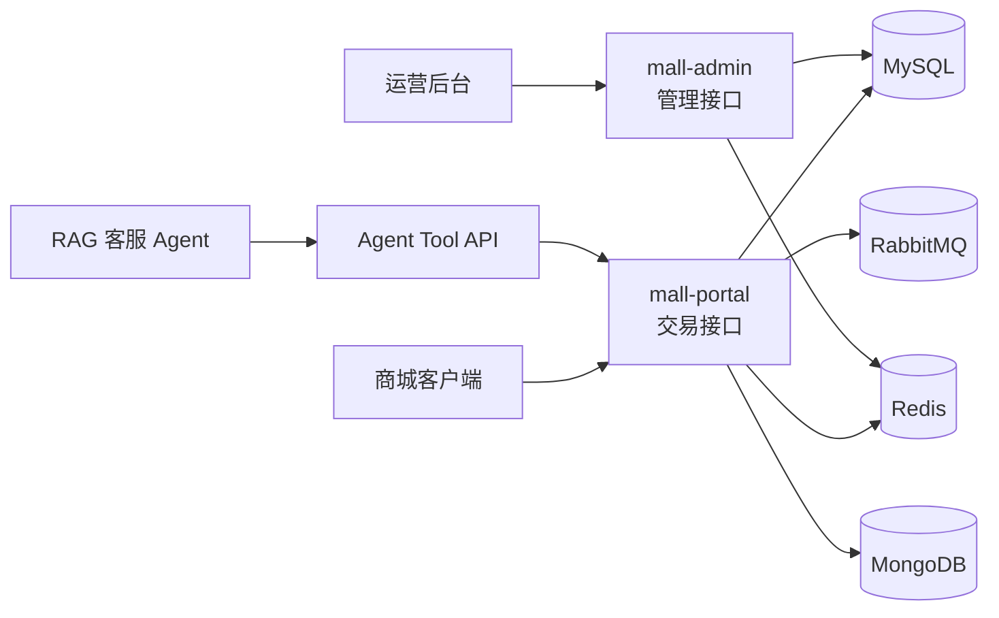
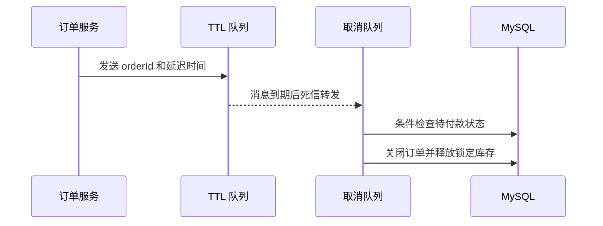

# 电商订单交易系统

一个围绕电商订单主链路进行强化的 Java 后端项目，覆盖订单创建、库存锁定、支付回调、超时取消、发货、收货、售后审核以及客服 Agent 查询。

本仓库基于 [macrozheng/mall](https://github.com/macrozheng/mall) 的 `dev-v2` 分支进行学习型二次开发。基础商城模块来自上游项目，本仓库重点展示订单交易链路的改造过程和新增功能，不将上游代码宣称为个人原创。

## 项目要解决的问题

普通的订单增删改查不足以体现交易系统的业务约束。本项目围绕以下问题进行改造：

- 用户连续点击提交按钮时，如何避免生成重复订单？
- 支付平台重复发送回调时，如何避免重复扣减库存？
- 待付款订单到期后，如何自动关闭并释放锁定库存？
- 发货、收货、关闭和售后状态如何避免非法跳转？
- 如何追踪一笔订单从创建到关闭的完整操作过程？
- 智能客服如何以标准工具接口查询订单、物流和售后信息？

## 系统结构



核心服务：

| 模块 | 作用 | 本地端口 |
| --- | --- | --- |
| `mall-portal` | 下单、支付、取消、收货以及 Agent 工具接口 | 8085 |
| `mall-admin` | 发货、关闭订单和售后审核 | 8081 |
| MySQL | 订单、商品、库存、售后等业务数据 | 3307 |
| Redis | 订单提交防重和缓存 | 6381 |
| RabbitMQ | 订单超时取消延迟消息 | 5673 / 15673 |
| MongoDB | 浏览记录等非核心数据 | 27018 |
| MinIO | 本地对象存储 | 9091 / 9002 |

## 本仓库的二次开发

### 1. 订单状态机

新增 `OrderStatus` 枚举集中维护订单状态和流转规则，业务代码不再到处直接比较魔法数字。

```text
待付款(0) --支付成功--> 待发货(1) --后台发货--> 已发货(2)
    |                                          |
    +--用户取消/超时关闭--> 已关闭(4)           +--确认收货--> 已完成(3)
```

主要约束：

- 只有待付款订单可以支付或取消。
- 只有待发货订单可以发货。
- 只有已发货订单可以确认收货。
- 只有已完成或已关闭订单可以由用户删除。
- 每次关键状态变化都写入 `oms_order_operate_history`。

### 2. 订单创建防重复提交

订单创建入口根据会员、地址、优惠券、积分、支付方式和购物车条目生成 SHA-256 业务指纹，并使用 Redis：

```text
SETNX mall:oms:orderSubmitLock:{memberId}:{fingerprint} value EX 10
```

首次请求成功获得短期锁并继续创建订单；相同参数在锁有效期内再次提交时直接返回“订单正在提交”，避免重复订单。

### 3. 支付回调幂等

支付成功不是“先查状态再无条件更新”，而是使用带旧状态条件的数据库更新：

```sql
UPDATE oms_order
SET status = 1, payment_time = ?
WHERE id = ? AND status = 0 AND delete_status = 0;
```

只有一个回调能够把订单从待付款更新为待发货。重复回调发现订单已经处于待发货状态时直接按成功处理，不重复扣减真实库存。

### 4. 库存锁定与释放

```text
创建订单：lock_stock 增加
支付成功：stock 扣减，lock_stock 释放
取消订单：lock_stock 释放
超时关闭：lock_stock 释放
```

新增 `GET /order/stockLockStatus/{orderId}`，用于查看订单关联 SKU 的总库存、锁定库存和可售库存，便于演示和排查库存链路。

### 5. RabbitMQ 超时取消

订单创建后发送带过期时间的消息到 TTL 队列。消息到期后经死信交换机进入取消队列，由消费者关闭仍处于待付款状态的订单。



项目提供手动发送和聚合追踪接口，可以用较短延迟验证整条链路，而不必等待真实业务超时时间。

### 6. 售后审核状态机

```text
待处理(0) --审核通过--> 退货中(1) --确认完成--> 已完成(2)
    |
    +--审核拒绝--> 已拒绝(3)
```

后台新增审核通过、拒绝和完成接口。非法状态跳转会被拒绝，审核结果同时写入订单操作日志；退货完成后同步关闭关联订单。

### 7. 客服 Agent 工具 API

`mall-portal` 对外提供只读工具接口，供 RAG 客服项目调用：

| 方法 | 接口 | 用途 |
| --- | --- | --- |
| GET | `/agent-tools/orders/{orderSn}` | 按订单号查询订单、商品和操作日志 |
| GET | `/agent-tools/orders/id/{orderId}` | 按订单 ID 查询详情 |
| GET | `/agent-tools/orders/{orderSn}/logistics` | 查询发货和物流信息 |
| GET | `/agent-tools/orders/{orderSn}/return-applies` | 查询关联售后申请 |
| GET | `/agent-tools/orders/{orderSn}/context` | 聚合订单、物流和售后上下文 |

这些接口将底层数据库模型转换为适合 Agent 消费的结构化结果，避免大模型直接访问数据库。

## 技术栈

- Java 8、Spring Boot 2.7
- Spring Security、JWT
- MyBatis、MyBatis Generator、MySQL 5.7
- Redis
- RabbitMQ
- MongoDB
- Swagger UI
- Docker Compose、Maven

## 快速启动

环境要求：JDK 8、Maven、Docker Desktop，并启用 WSL 2 后端。

### 1. 启动基础设施

PowerShell：

```powershell
Copy-Item .env.local.example .env.local
.\scripts\start-local-infra.ps1
```

WSL：

```bash
cp .env.local.example .env.local
docker compose --env-file .env.local -f docker-compose.local.yml up -d
```

### 2. 打包服务

```powershell
mvn -pl mall-admin,mall-portal -am -DskipTests package
```

项目内的 `.mvn/maven.config` 已跳过原项目 Docker 镜像构建，并将 Maven 本地仓库放在项目目录中。

### 3. 启动应用

```powershell
java -jar mall-admin\target\mall-admin-1.0-SNAPSHOT.jar --spring.profiles.active=local
java -jar mall-portal\target\mall-portal-1.0-SNAPSHOT.jar --spring.profiles.active=local
```

访问地址：

- 后台 Swagger：<http://127.0.0.1:8081/swagger-ui/>
- 商城 Swagger：<http://127.0.0.1:8085/swagger-ui/>
- RabbitMQ 控制台：<http://127.0.0.1:15673/>

更完整的环境说明见 [LOCAL_RUN.md](./LOCAL_RUN.md)，功能与验证步骤见 [PROJECT_PLAN.md](./PROJECT_PLAN.md)。

## 代码阅读入口

| 主题 | 代码位置 |
| --- | --- |
| 订单状态机 | `mall-common/.../enums/OrderStatus.java` |
| 售后状态机 | `mall-common/.../enums/ReturnApplyStatus.java` |
| 下单、防重、支付和取消 | `mall-portal/.../service/impl/OmsPortalOrderServiceImpl.java` |
| 延迟消息消费者 | `mall-portal/.../component/CancelOrderReceiver.java` |
| 库存和超时追踪接口 | `mall-portal/.../controller/OmsPortalOrderController.java` |
| 客服工具接口 | `mall-portal/.../controller/AgentOrderToolController.java` |
| 客服工具数据聚合 | `mall-portal/.../service/impl/AgentOrderToolServiceImpl.java` |
| 后台发货和关闭 | `mall-admin/.../service/impl/OmsOrderServiceImpl.java` |
| 售后审核 | `mall-admin/.../service/impl/OmsOrderReturnApplyServiceImpl.java` |

## 当前边界

- 项目重点是 Java 后端交易链路，前端管理页面不包含在本仓库中。
- 支付使用回调模拟接口，未配置真实商户密钥。
- 物流结果来自订单发货字段和业务提示，未接入第三方物流平台。
- 防重复提交解决短时间相同请求重复进入，不等同于完整的分布式事务方案。
- 目前以功能链路验证为主，没有宣称未经压测的数据或并发指标。

## 上游与许可

基础项目来源：[macrozheng/mall](https://github.com/macrozheng/mall)。

仓库保留上游 Git 历史，便于区分基础代码与本次二次开发提交。本项目继续遵循上游仓库的 Apache License 2.0，详见 [LICENSE](./LICENSE)。
